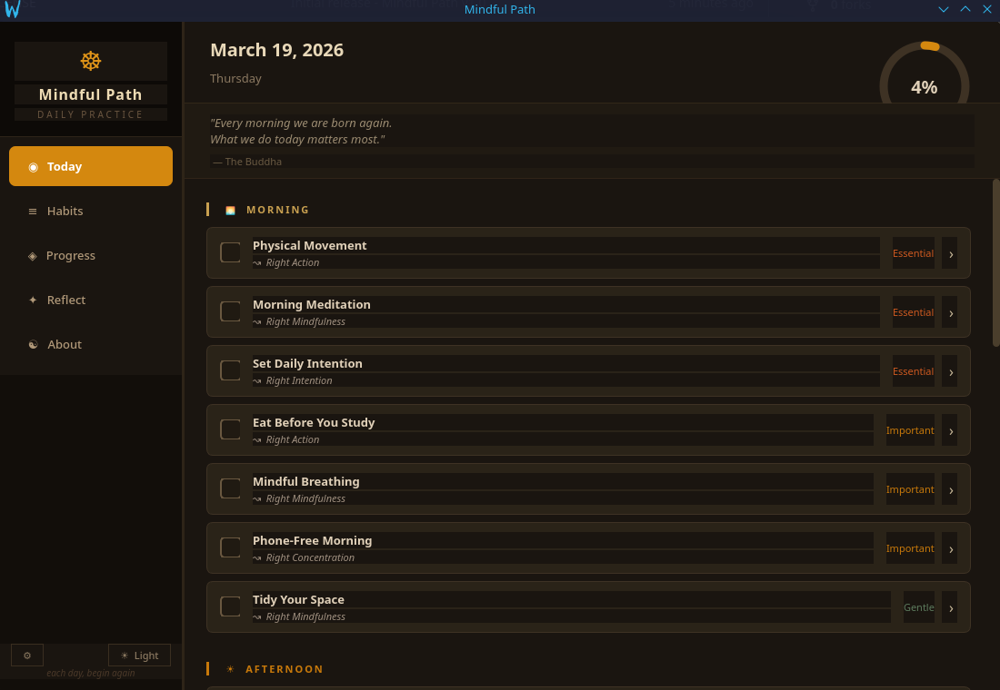

# ☸ Mindful Path

A Buddhist-inspired daily habit tracker for students — built with Python and PyQt6.



---

## Features

- **Daily habit checklist** grouped by time of day (Morning → Afternoon → Evening)
- **23 pre-loaded student habits** drawn from research and Buddhist practice
- **Streak tracking** with compassionate framing — no punishment for missed days
- **Click-through habit detail** with notes, stats, and 7-day history
- **Daily reflection** — morning intention, evening review, gratitude, mood
- **Progress view** — weekly bar chart, per-habit streaks and completion rates
- **Completion bell** — a generated mindfulness bell tone on each check-off
- **Desktop notifications** — gentle reminders at configurable times
- **Dark & light mode** — toggle with one click, preference saved
- **Eightfold Path integration** — each habit linked to a path aspect
- **Data stored locally** in `~/.mindful_path/tracker.db` — no account, no cloud

---

## Buddhist philosophy

Mindful Path draws from universal Buddhist principles without dogma:

- **Impermanence** — each day is fresh, missed days don't define you
- **The Middle Way** — balance between effort and rest
- **Right Effort** — consistent, sustainable practice over frantic bursts
- **Self-compassion** — gentle language throughout, no "failed" states
- **Mindfulness** — present-moment awareness woven into each habit

---

## Installation

**Requirements:** Python 3.11+, PyQt6

```bash
# Clone the repo
git clone https://github.com/DissoWharf/mindful-path.git
cd mindful-path

# Install dependencies
pip install PyQt6

# Run
python3 main.py
```

### Linux desktop launcher

To add Mindful Path to your app menu:

```bash
# Make the launcher executable
chmod +x mindful-path.sh

# Generate the app icon
python3 generate_icon.py

# Install the desktop entry
cp mindful-path.desktop ~/.local/share/applications/
update-desktop-database ~/.local/share/applications/
```

Or run the install script:

```bash
chmod +x install.sh && ./install.sh
```

---

## Habits included

| Category | Habits |
|---|---|
| 🌅 Morning | Meditation, Mindful Breathing, Phone-Free Morning, Set Daily Intention, Tidy Your Space, Physical Movement, Eat Before You Study |
| ☀ Afternoon | Deep Study Session, Self-Testing, Weekly Planning, Weekly Review, Ask for Help |
| 🌙 Evening | Review Notes, Gratitude Practice, Evening Reflection, Plan Tomorrow Tonight, Restful Sleep |
| ◦ Anytime | Inspired Reading, Digital Detox, Hydration, Nourishing Meal, Act of Kindness, Connect with Someone |

All habits are editable — add your own, archive ones that don't fit, assign any time of day.

---

## Tech stack

- **Python 3.11+**
- **PyQt6** — GUI framework
- **SQLite** — local database (via Python's built-in `sqlite3`)
- No other dependencies

---

## Data & privacy

All data is stored locally in `~/.mindful_path/tracker.db`. Nothing leaves your machine. No accounts, no telemetry, no internet required.

---

## Contributing

Pull requests welcome. See [CONTRIBUTING.md](CONTRIBUTING.md).

---

## License

MIT — see [LICENSE](LICENSE)
